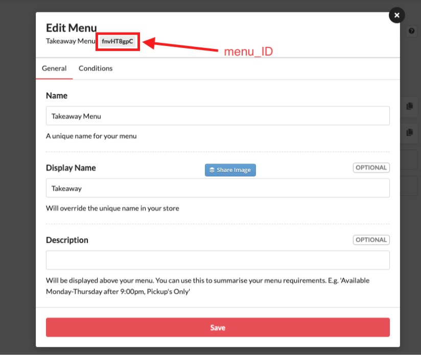

# 📑 Setting up POS Menu Items

## **Table of Content**

\
[#login-to-cloud-pos-backoffice](setting-up-pos-menu-items.md#login-to-cloud-pos-backoffice "mention")

[#setting-up-pos-menu-item-cloud-backoffice](setting-up-pos-menu-items.md#setting-up-pos-menu-item-cloud-backoffice "mention")

[#setting-item-modifiers](setting-up-pos-menu-items.md#setting-item-modifiers "mention")

[#push-cloud-menu-to-pos](setting-up-pos-menu-items.md#push-cloud-menu-to-pos "mention")

### ☁️Login to Cloud POS Backoffice

Login to Cloud Backoffice at  [https://pos.cloudorders.co/](https://pos.cloudorders.co/) using supplied login/password by your account manager

### 📝 Setting Up POS Menu Item (Cloud Backoffice)

Go to > Backoffice  to view add/update Items, Modifiers&#x20;

<figure><figcaption></figcaption></figure>

**Backoffice > Item Groups**

<figure><figcaption></figcaption></figure>

Backoffice > Items

* Click on the Item group to see individual items

<figure><figcaption></figcaption></figure>

Setting Item Details, Pricing and Printers&#x20;

<figure><figcaption></figcaption></figure>

### 🔗 Setting Item Modifiers

Go to Back Office > Modifiers

<figure><figcaption>
Modifiers
</figcaption></figure>

Setting up Modifiers and Price

<figure><figcaption></figcaption></figure>

<figure><figcaption></figcaption></figure>

### ☁️ Push Cloud Menu to POS

Go to Back office > Upload changes to POS

<figure><figcaption></figcaption></figure>

<figure><figcaption></figcaption></figure>

#### Download Menu changes to POS Terminal

Logout and log back in to POS Terminal to view downlod link as shown in below screen, click to download the menu

<figure><figcaption></figcaption></figure>

<figure><figcaption></figcaption></figure>
